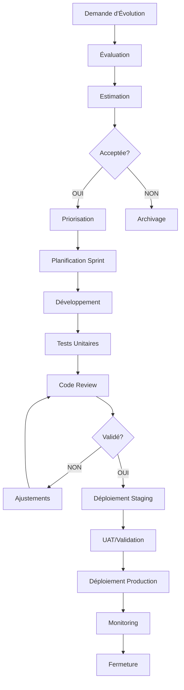

# Plan de Maintenance et Perennité - CESIZen

## Livrables pour Bloc 3 - Déployer et Sécuriser les Applications Informatiques

---

## 1. INTRODUCTION

Le présent plan de maintenance couvre la gestion post-déploiement de CESIZen. Il établit les processus et outils pour assurer la stabilité, la performance et l'évolutivité de l'application.

### Objectifs Clés

- Minimiser les interruptions de service (Target: 99.5% uptime)
- Résoudre rapidement les anomalies critiques (SLA: 4h)
- Adapter l'application aux évolutions technologiques
- Maintenir la conformité et la sécurité
- Assurer la satisfaction des utilisateurs

---

## 2. GESTION DES ANOMALIES

### 2.1 Processus de Signalement

**Canaux disponibles**:

1. **Utilisateurs finaux** → Contact support → GitHub Issue (bug_report.md)
2. **Administrateurs** → Console admin → Création directe d'issue
3. **Monitoring** → Alertes automatiques → Ticket escalade
4. **Équipe développement** → Détection interne → Issue rapide

**Flux de traitement**:

```
Détection → Signalement → Triage → Assignation → Correction → Test → Résolution
```

### 2.2 Grille de Sévérité

| Sévérité     | Critères                                                                 | RTO     | RTM       |
| ------------ | ------------------------------------------------------------------------ | ------- | --------- |
| **Critique** | - Système indisponible<br>- Perte de données<br>- Faille sécurité avérée | 1h      | 4h        |
| **Haute**    | - Fonctionnalité majeure indisponible<br>- Impact > 10% utilisateurs     | 4h      | 1 jour    |
| **Moyenne**  | - Service dégradé<br>- Workaround disponible<br>- Impacts limités        | 1 jour  | 3 jours   |
| **Basse**    | - Défaut cosmétique<br>- Absence d'impact user                           | 3 jours | 1 semaine |

### 2.3 Cycle de Vie des Anomalies

**Statuts GitHub**:

- 🔴 **Ouvert** - Signalé, en attente de triage
- 🟠 **Triagé** - Sévérité assignée, en backlog
- 🟡 **En cours** - Assigné à développeur
- 🟢 **En test** - Code review et tests exécutés
- ✅ **Résolu** - Déployé en production
- ❌ **Fermé** - Validation complète

### 2.4 MTTR (Mean Time To Repair)

| Métrique | Définition                   | Cible           |
| -------- | ---------------------------- | --------------- |
| **MTTR** | Temps détection → Résolution | < 4h (critique) |
| **MTTD** | Temps occurrence → Détection | < 15min         |
| **MTBF** | Temps moyen entre pannes     | > 30 jours      |

---

## 3. GESTION DES ÉVOLUTIONS

### 3.1 Types d'Évolutions

1. **Évolutions Fonctionnelles**
   - Nouvelles features
   - Processus: Demande → Estimation → Planification → Dev → UAT → Prod

2. **Améliorations (Enhancement)**
   - Optimisations de performance
   - Amélioration UX/UI
   - Processus: Rapide (1-2 jours dev)

3. **Maintenance Technique**
   - Mise à jour des dépendances
   - Refactoring code
   - Nettoyage technique
   - Processus: Trimestriel (1 sprint)

4. **Documentation**
   - Docs utilisateur
   - Docs technique
   - Processus: Continu

### 3.2 Méthodologie de Gestion



### 3.3 Critères d'Acceptation

Toute évolution doit:

- ✅ Avoir des critères d'acceptation explicites
- ✅ Inclure des tests (couverture minimum 80%)
- ✅ Passer la revue de code
- ✅ Être testée en staging
- ✅ Inclure documentation de l'utilisateur

### 3.4 Planification Sprint

**Cadence**: Sprints de 2 semaines
**Planning**: Lundi 10h00
**Retrospective**: Vendredi 16h00
**Capacity**: 80 points (moyenne équipe)

**Allocation par sprint**:

- 60% : Features & enhancements
- 20% : Bug fixes
- 20% : Technical debt & infra

### 3.5 Timeboxing des Tâches

| Type               | Timeboxing        |
| ------------------ | ----------------- |
| Bug Critique       | Immédiat          |
| Bug Haute Sévérité | Ce sprint         |
| Feature Small      | < 3 jours         |
| Feature Medium     | 3-5 jours         |
| Feature Large      | Diviser en tâches |

---

## 4. VEILLE TECHNOLOGIQUE

### 4.1 Domaines Surveillés

#### A. Sécurité (Quotidienne)

- Vulnérabilités npm packages
- CVEs applicables
- Security advisories
- Outils: Dependabot, npm audit, Snyk

#### B. Écosystème Frontend (Hebdomadaire)

- Nuxt.js releases et updates
- Vue.js updates
- Package tendances
- Performance tips
- Sources: GitHub releases, npm trends

#### C. Backend & Database (Hebdomadaire)

- Prisma ORM updates
- PostgreSQL updates
- Node.js releases
- Performance tuning
- Sources: GitHub releases, official blogs

#### D. Infrastructure (Hebdomadaire)

- Docker updates
- GitHub Actions features
- CI/CD best practices
- Automation opportunities
- Sources: Docker hub, GitHub blog

### 4.2 Politique de Mise à Jour

```
Découverte → Évaluation → Décision → Planning → Exécution → Validation
```

| Type de Patch  | Délai Max | Process                   |
| -------------- | --------- | ------------------------- |
| Security Patch | 24h       | Direct prod (après tests) |
| Minor Update   | 1 sprint  | Tests + staging           |
| Major Version  | 2-4 sem   | POC + Migration plan      |
| Beta Release   | Évaluer   | Staging uniquement        |

### 4.3 Registre de Veille

**Emplacement**: `.github/TECH_WATCH_LOG.md`

**Contenu**:

- Date découverte
- Technologie/Vulnérabilité
- Source
- Impact assessment
- Action décidée
- Date résolution

**Revue**: Hebdomadaire par Tech Lead

### 4.4 Responsabilités

| Rôle          | Responsabilités                  |
| ------------- | -------------------------------- |
| **Tech Lead** | Revue hebdo, décisions updates   |
| **Dev Team**  | Analyse d'impact, POC            |
| **DevOps**    | Infrastructure eval, déploiement |
| **Security**  | Risk assessment                  |

---

## 5. OUTILS ET OUTILLAGE

### 5.1 GitHub Issues - Gestion des Tickets

**Configuration**:

- ✅ Templates: bug, feature, security
- ✅ Labels: 15+ labels standardisés
- ✅ Milestones: Sprints bi-hebdo
- ✅ Projects: Kanban board

**Automatisations**:

- Auto-add à project sur création
- Auto-label basé sur titre
- Auto-close stale issues (60j)
- Prompt pour priorité

**Lien**: https://github.com/PaulOwO/CeziZen-DevopsTp/issues

### 5.2 GitHub Project Board

**Configuration**:

- Table view avec status
- Colonne: Backlog → Todo → In Progress → In Review → Done
- Automations sur PR events
- Velocity tracking

**Lien**: https://github.com/PaulOwO/CeziZen-DevopsTp/projects

### 5.3 GitHub Actions - Automatisations

**Workflow 1: Dependency Check**

- Exécution: Chaque lundi 9h00 UTC
- Actions: npm audit, outdated check
- Résultat: Rapport + issue creation si problèmes

**Workflow 2: Issue Triage**

- Exécution: À chaque nouvelle issue
- Actions: Auto-label, stale marking, priority prompt
- Résultat: Issues correctement catégorisées

### 5.4 Monitoring & Alertes

**Métriques principales**:

- Application errors
- API response time
- Database query time
- Memory usage
- Disk space

**Outils recommandés**:

- GitHub Actions logs
- Application logging
- Database monitoring
- Custom dashboards

---

## 6. SUPPORT ET ESCALADE

### 6.1 Niveaux de Support

```
Utilisateur → Support L1 (2h) → Dev Team L2 (4h) → Tech Lead L3 (8h)
```

| Niveau | Type                      | Temps Réponse | Résolution     |
| ------ | ------------------------- | ------------- | -------------- |
| **L1** | Support utilisateur, docs | < 2h          | Support portal |
| **L2** | Développeurs, debugging   | < 4h          | Development    |
| **L3** | Tech Lead/Architects      | < 8h          | Strategic      |

### 6.2 Canaux de Communication

- **Support utilisateur**: support@cesizen.fr
- **Équipe développement**: dev-team@cesizen.fr
- **Escalade sécurité**: security@cesizen.fr
- **Urgence critique**: +33 X XX XX XX XX

### 6.3 Gestion de Crise

**Incident Critique**:

1. Notification immédiate (alertes SMS/Slack)
2. Réunion d'urgence (< 15min)
3. Mise à jour status (toutes les 30min)
4. Post-mortem (24h après)

**Template**: `docs/incident-postmortem-template.md`

---

## 7. MÉTRIQUES ET RAPPORTS

### 7.1 Indicateurs de Performance

**Mensuels**:

- Nombre d'incidents par sévérité
- MTTR moyen
- Nombre d'évolutions déployées
- Couverture de tests
- Uptime %

**Trimestriels**:

- Tendance d'évolution
- Risques identifiés non-traités
- Satisfaction utilisateur
- Coût de maintenance

### 7.2 Rapports

**Rapport Mensuel** (5 pages):

- Résumé des incidents
- Évolutions déployées
- Métriques performance
- Risques/Opportunités
- Actions recommandées

**Rapport Trimestriel** (10 pages):

- Tendance complète
- Recommandations stratégiques
- Roadmap technologique
- Budget/ressources

---

## 8. BONNES PRATIQUES

### 8.1 Développement Maintenable

- ✅ Code review obligatoire (2 approvals)
- ✅ Tests unitaires (80% couverture min)
- ✅ Tests d'intégration pour features critiques
- ✅ Linting & formatting automatisés
- ✅ Documentation code complète
- ✅ Commits messages explicites
- ✅ Feature flags pour déploiements progressifs

### 8.2 Documentation

- ✅ README à jour
- ✅ Docs utilisateur maintenues
- ✅ Docs technique de l'architecture
- ✅ Runbooks pour procédures opérationnelles
- ✅ Changelog pour chaque release

### 8.3 Testing Strategy

- ✅ Unit tests: Composants & utilities
- ✅ Integration tests: API endpoints
- ✅ E2E tests: User workflows critiques
- ✅ Performance tests: Core metrics
- ✅ Security tests: OWASP Top 10

---

## 9. CALENDRIER MAINTENANCE

### 9.1 Planning Régulier

| Activité           | Fréquence   | Jour/Heure  | Durée |
| ------------------ | ----------- | ----------- | ----- |
| Sprint Planning    | Hebdo       | Lun 10h     | 1h    |
| Daily Standup      | Quotidienne | 09h30       | 15min |
| Sprint Review      | Hebdo       | Ven 14h     | 1h    |
| Retro              | Hebdo       | Ven 16h     | 1h    |
| Tech Watch Review  | Hebdo       | Mar 10h     | 30min |
| Maintenance Window | Hebdo       | Mar 22h-00h | 2h    |

### 9.2 Mises à Jour Programmées

- **Security patches**: 24h max après découverte
- **Minor updates**: Prochain sprint
- **Major versions**: 2-4 semaines evaluation
- **Dépendances**: Audit mensuel

---

## 10. ANNEXES

### A. Contacts Clés

| Rôle             | Nom          | Email                | Téléphone |
| ---------------- | ------------ | -------------------- | --------- |
| Tech Lead        | [Prénom Nom] | tech-lead@cesizen.fr | +33 X     |
| Product Owner    | [Prénom Nom] | po@cesizen.fr        | +33 X     |
| DevOps Lead      | [Prénom Nom] | devops@cesizen.fr    | +33 X     |
| Security Officer | [Prénom Nom] | security@cesizen.fr  | +33 X     |

### B. Ressources

- GitHub Repo: https://github.com/PaulOwO/CeziZen-DevopsTp
- Issue Tracker: https://github.com/PaulOwO/CeziZen-DevopsTp/issues
- Project Board: https://github.com/PaulOwO/CeziZen-DevopsTp/projects
- Docs: `docs/` folder
- Tech Watch: `.github/TECH_WATCH_LOG.md`

### C. Documentation Associée

- [Plans de Maintenance Détaillé](../docs/MAINTENANCE_PLAN.md)
- [Stratégie de Veille Technologique](../docs/TECH_WATCH_STRATEGY.md)
- [Template Post-Mortem](../docs/incident-postmortem-template.md)

---

**Document de référence pour Bloc 3 - Déployer et Sécuriser les Applications Informatiques**

**Version**: 1.0  
**Date**: 2026-05-28  
**Auteur**: CESIZen Development Team  
**Prochaine révision**: 2026-08-28
